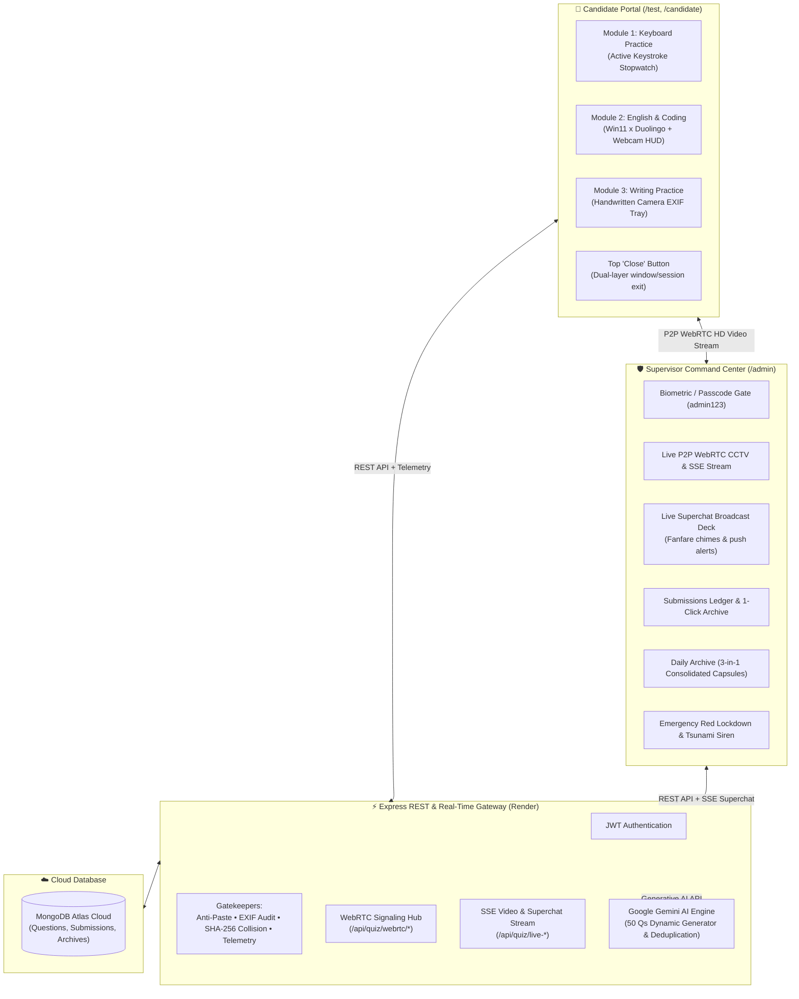

# Sentinel Proctor • Brother Compliance SaaS & Forensic Intelligence Portal 🛡️👁️

<p align="center">
  
  
  
  
  
  
  
  
</p>

An enterprise-grade, anti-cheat compliance and continuous surveillance system engineered with the **MERN Stack** (MongoDB Atlas + Express + React 18 + Node.js) paired with **WebRTC P2P Video Streaming** and **Google Gemini AI**.

Engineered for strict remote candidate oversight, continuous authentic skill attestation, and anti-bypass proctoring.

---

## 🌐 Live Production Deployment

| Service | Direct URL | Description |
| :--- | :--- | :--- |
| **🛡️ Admin Surveillance Gate** | [brother-compliance-saas.onrender.com](https://brother-compliance-saas.onrender.com/) | Master control room, live CCTV, archives & forensics *(Passcode: `admin123`)* |
| **🎯 Candidate Workstation** | [brother-compliance-saas.onrender.com/test](https://brother-compliance-saas.onrender.com/test) | Dedicated, distraction-free candidate portal for daily tasks |
| **📡 Health Check API** | [brother-compliance-saas.onrender.com/api/health](https://brother-compliance-saas.onrender.com/api/health) | Live backend and gatekeeper operational status |

---

## 🌟 Architecture & Dual-Enclave Partitioning



---

## 🎯 The Candidate Enclave (`/test`, `/candidate`, `/brother`)

* **Zero Distraction Isolation**: All supervisor headers, admin links, dispatch buttons, and theme toggles are **100% removed** for the candidate.
* **Top "Close" Button**: A prominent, rose-tinted `[ ✕ Close ]` button is pinned to the header command bar.
  * **Dual-Layer Close Mechanism**: Executes programmatic script closure (`window.close()`). If the browser security model blocks direct window closure (e.g. tab was opened manually), it immediately unmounts the workspace and presents a clean **Workstation Session Closed** screen with one-click fallback exit (`about:blank`).
* **Permanent Cyber Dark Aesthetics**: Military-grade obsidian backdrop (`#080c14`) with glassmorphic cards, luminous cyan accents, and high-contrast monospace typography.
* **3 Mandatory Disciplines**: Complete and verify all three daily modules before midnight.

---

## 📋 The 3 Mandatory Daily Disciplines

### ⌨️ Module 1: Keyboard Practice & Active Stopwatch
* **Zero Arbitrary Time Limits**: No countdown timers or sudden cut-offs. The candidate has the freedom to type as much or as long as necessary.
* **Starts at `00:00`**: The stopwatch begins counting up only on the first physical keystroke (`● RECORDING ACTIVE WRITING TIME`).
* **Strict Anti-Idling Grace Detector**: If the candidate stops typing for more than **3.5 seconds**, the stopwatch instantly pauses (`❚❚ PAUSED`). Idle minutes cannot be accumulated.
* **Anti-Paste & Injection Shield**:
  * 🚫 `Ctrl+V` and right-click paste events are intercepted and rejected.
  * 🚫 Drag-and-drop text/file insertion is prohibited.
  * 🚫 Tab switches and window blur trigger an immediate security strike and sound the Red Lockdown Alarm on the supervisor's console.
* **Dynamic Telemetry HUD**: Displays real-time words typed, active duration, and live calculated Words Per Minute (WPM).
* **Reset & Clear**: Includes a `[ ↺ CLEAR ]` button to wipe the buffer and restart cleanly.

---

### 🦉 Module 2: Windows 11 Fluent x Duolingo English & Coding Engine
A custom in-app examination environment powered by **Google Gemini AI** and native **WebRTC Video CCTV Surveillance**:

1. **100% Dynamic Gemini AI Question Engine**:
   * **Zero Static Files**: Legacy static question banks were purged. Every question is dynamically synthesized via the Google Gemini API (`gemini-2.5-flash` / `gemini-1.5-flash`).
   * **Staged 50-Question Curriculum**:
     * **Questions 1 – 25**: Everyday beginner English, workplace vocabulary, and practical grammar.
     * **Questions 26 – 50**: Beginner computer science, HTML/CSS/JavaScript, loops, variables, functions, and debugging.
   * **Zero Duplicates Between Consecutive Tests**: A FIFO sliding-window cache (`recentlyServedTexts` up to 500 questions) guarantees that consecutive test sessions never repeat any previously encountered questions.
   * **Zero-Knowledge Dealer (`GET /api/quiz/session`)**: Answer keys, correct option indexes, and explanations are strictly scrubbed server-side before delivering the payload to the browser. Inspecting network payloads reveals zero answers.

2. **Server-Side Grader & Speed Anomaly Telemetry (`POST /api/quiz/grade`)**:
   * Answers are validated entirely on the backend against server database records.
   * **Bot Speed Detection**: Answers submitted in `< 0.8 seconds` are flagged as rapid guesswork or automated script anomalies, penalizing the cadence integrity score.

3. **Real-Time WebRTC CCTV & Biometric Webcam HUD 📹**:
   * **Candidate Picture-in-Picture**: Live webcam stream embedded inside the quiz interface with cyan HUD reticles, recording beacon (`🔴 LIVE SURVEILLANCE`), and hardware device detection.
   * **Peer-to-Peer WebRTC**: Full 30 FPS ultra-low latency direct video stream to the supervisor's CCTV deck via STUN traversal (`stun.l.google.com:19302`) with ICE candidate serialization.
   * **SSE Fallback**: Server-Sent Events stream snapshots (~1.2 FPS) if WebRTC UDP traffic is firewalled.
   * **Event-Triggered Proctor Snapshots**: Automatic captures taken at assessment start, every 35 seconds, and instantly upon any tab-blur event with cybernetic timestamp watermarks.

4. **Live Streamer Alert / Superchat Broadcast Deck 👑📢**:
   * The supervisor can push live notices directly onto the candidate's active quiz screen (e.g., *"I can see you!"*, *"Stay focused!"*, or custom text).
   * Renders a glowing Twitch/YouTube style donation banner with an ascending 4-tone Web Audio synthesized fanfare chime (`F5 -> A5 -> C6 -> F6`).

---

### ✍️ Module 3: Writing Practice & Hardware EXIF Provenance
* **Daily 10-Point Deterministic Topic**: Serves a structured daily writing prompt covering diverse real-world subjects.
* **100% Real Pen & Paper Enforcement**: Sample cheat loaders are completely removed. Candidates must upload actual photos of physical handwritten pages.
* **Multi-Photo Page Tray**: Supports up to 5 individual handwritten pages per submission with page badges (`PAGE 1`, `PAGE 2`), delete controls, and click-to-zoom modal lightboxes.
* **Hardware Sensor EXIF Extraction**:
  * 📱 **Device Model**: Validates phone camera hardware (e.g., Apple iPhone, Samsung Galaxy).
  * 🕒 **DateTimeOriginal Delta**: Confirms the photo was captured **today during the active session** rather than recycled from past work.
  * 🛡️ **Tampering Audit**: Checks for uncompressed camera firmware origins to block Photoshop, Canva, or digital generator artifacts.
* **Cryptographic Hash Collision Detection**: Evaluates MD5 and SHA-256 hashes against past submissions to reject duplicate file re-uploads.

---

## 🛡️ Supervisor Enclaves (`/admin`)

* **Protected Gate**: Secured by a passcode gate (`admin123`) with persistent session tokens.
* **📊 Executive Dashboard (`/admin`)**: Real-time compliance health, active strikes, 1-click candidate link generator, and live embedded CCTV monitor.
* **📥 Dedicated Submissions Box (`/admin/submissions`)**:
  * Complete ledger of submitted tasks awaiting review.
  * 1-click copy for typed essays.
  * Full-resolution zoom lightbox for handwritten homework photos.
  * Webcam surveillance gallery displaying all watermarked captures.
  * Question-by-question quiz answer review with accuracy metrics and grammar explanations.
  * 1-Click **"Approve & Archive"** and **"Reset for Tomorrow"** actions.
* **📁 Daily Submission Archive (`/admin/archive`)**:
  * **3-in-1 Consolidated Daily Capsule Cards**: Consolidates all 3 modules of each date into a single clean card.
  * **1-Click Date Filters**: Dedicated toolbar buttons badged with `[ 📅 Today • 3/3 DONE ✓ ]`.
  * **JSON Export**: 1-click download of the complete compliance archive (`brother_compliance_archive_YYYY-MM-DD.json`).
* **🛡️ Anti-Cheat Forensic Console (`/admin/anti-cheat`)**: Deep forensics inspecting keystroke intervals, focus loss history, paste interception logs, and camera sensor fingerprints.
* **🚨 Emergency Red Lockdown & Tsunami Siren**:
  * An intentional security breach transforms the supervisor interface into full **Crimson Alert** (`#150205`).
  * Triggers an authentic synthesized **10:12 dual-port rotary motor acoustic siren chord** via the Web Audio API.
  * State persists across refreshes and requires physical supervisor intervention: **`[ 🛑 PHYSICALLY DISARM ALARM ]`**.

---

## 📡 Complete REST API Endpoint Inventory

| # | Method | Endpoint | Pipeline / Access | Description | Status |
|---|---|---|---|---|---|
| **Core & Auth** | | | | | |
| 1 | `GET` | `/api/health` | Public | Operational health check & gatekeeper statuses | ✅ 200 OK |
| 2 | `GET` | `/api/network-info` | Public | LAN IP & cloud discovery URLs for multi-device testing | ✅ 200 OK |
| 3 | `POST` | `/api/auth/login` | Public | Supervisor / Candidate authentication & JWT grant | ✅ 200 OK |
| 4 | `POST` | `/api/auth/register` | Public | Registers user profile, hashes password, returns JWT | ✅ 201 Created |
| 5 | `GET` | `/api/auth/me` | Bearer JWT | Decrypts token claims and returns authenticated profile | ✅ 200 OK |
| **Tasks & Disciplines** | | | | | |
| 6 | `GET` | `/api/tasks` | Public | Retrieves active compliance task definitions | ✅ 200 OK |
| 7 | `GET` | `/api/tasks/:id` | Public | Retrieves single compliance task definition | ✅ 200 OK |
| 8 | `POST` | `/api/tasks` | Public | Creates custom compliance tasks dynamically | ✅ 201 Created |
| 9 | `GET` | `/api/tasks/daily-writing-topic` | Public | Returns deterministic 10-point daily handwriting topic | ✅ 200 OK |
| **Quiz & AI Engine** | | | | | |
| 10 | `GET` | `/api/quiz/settings` | Public | Fetches question count limit (default: 50) | ✅ 200 OK |
| 11 | `POST` | `/api/quiz/settings` | Public | Updates question count limit | ✅ 200 OK |
| 12 | `GET` | `/api/quiz/session` | Zero-Knowledge | Deals 50 dynamic Gemini AI questions with scrubbed answers | ✅ 200 OK |
| 13 | `POST` | `/api/quiz/grade` | Speed Telemetry | Evaluates answers, audits <0.8s bot speeds (Passmark: 35) | ✅ 200 OK |
| 14 | `GET` | `/api/quiz/stats` | Public | Question bank metrics, DB status, and AI engine status | ✅ 200 OK |
| 15 | `POST` | `/api/quiz/generate` | Public | On-demand batch generation of AI questions | ✅ 200 OK |
| **Surveillance & WebRTC** | | | | | |
| 16 | `POST` | `/api/quiz/live-frame` | Public | Candidate broadcasts snapshot frame (1-2 FPS fallback) | ✅ 200 OK |
| 17 | `GET` | `/api/quiz/live-stream` | SSE Stream | Supervisor Server-Sent Events live video feed | ✅ 200 OK |
| 18 | `GET` | `/api/quiz/live-frame` | Public | Polling fallback for active stream status | ✅ 200 OK |
| 19 | `POST` | `/api/quiz/live-stream-end` | Public | Clean termination of live webcam stream | ✅ 200 OK |
| 20 | `POST` | `/api/quiz/live-message` | Public | Supervisor broadcasts live superchat notice to candidate | ✅ 200 OK |
| 21 | `POST` | `/api/quiz/webrtc/offer` | WebRTC | Candidate posts SDP offer for P2P video call | ✅ 200 OK |
| 22 | `POST` | `/api/quiz/webrtc/answer` | WebRTC | Supervisor posts SDP answer to complete handshake | ✅ 200 OK |
| 23 | `POST` | `/api/quiz/webrtc/ice` | WebRTC | Exchanges ICE candidates for UDP NAT traversal | ✅ 200 OK |
| 24 | `GET` | `/api/quiz/webrtc/status` | WebRTC | Checks WebRTC signaling connection state | ✅ 200 OK |
| 25 | `POST` | `/api/quiz/webrtc/reset` | WebRTC | Resets / disconnects WebRTC session | ✅ 200 OK |
| 26 | `POST` | `/api/quiz/webrtc/request`| WebRTC | Supervisor requests fresh WebRTC call from candidate | ✅ 200 OK |
| **Submissions & Forensics** | | | | | |
| 27 | `POST` | `/api/submissions/submit` | Multer, Hash, EXIF | Submits task payload with cryptographic hash & EXIF checks | ✅ 201 Created |
| 28 | `POST` | `/api/tasks/submit` | Multer, Hash, EXIF | Unified submission route for task pipelines | ✅ 201 Created |
| 29 | `GET` | `/api/submissions` | Public | Retrieves all submission records and audit logs | ✅ 200 OK |
| 30 | `GET` | `/api/submissions/:id` | Public | Retrieves detailed single submission audit log | ✅ 200 OK |
| 31 | `GET` | `/api/reports/:sessionId` | Digital Forensics | Generates structured forensic compliance audit report | ✅ 200 OK / 404 |

---

## 🔒 Security & Anti-Cheat Summary

| Protection Layer | Enforcement Mechanism | Action on Violation |
| :--- | :--- | :--- |
| **External Clipboard** | Event interceptor on `paste` and `drop` | Input blocked + Red Lockdown Alarm |
| **Focus Loss & Tab Switching** | `visibilitychange` & `window.onblur` surveillance | Strike logged + snapshot taken + Red Lockdown Alarm |
| **Idle Time Exploitation** | 3.5s keystroke grace cadence detector | Stopwatch automatically pauses |
| **Recycled Photo Submissions** | SHA-256 / MD5 cryptographic collision checks | Blocked upon submission attempt |
| **Fake Handwritten Work** | Hardware EXIF tags & capture timestamp delta | Flagged if edited, non-camera, or not taken today |
| **Bot Speed Exploitation** | Per-question response timing detector (<0.8s) | Flagged as cadence anomaly, integrity score drops |
| **Inspect Element Cheat** | Zero-knowledge question dealer scrubbing | Answers are physically absent from frontend memory |
| **Alarm Dismissal** | Hardened `localStorage` state retention | Requires physical disarm on supervisor dashboard |

---

## 🚀 Running Locally

### Prerequisites
* **Node.js**: v18.0.0 or higher
* **MongoDB**: MongoDB Atlas connection string (or local MongoDB on port 27017)
* **Google Gemini API Key**: *(Optional but recommended for infinite AI questions)* — get one free at [aistudio.google.com](https://aistudio.google.com/)

### 1. Clone the Repository
```bash
git clone https://github.com/Maheshwarandev/sentinel-proctor.git
cd sentinel-proctor
```

### 2. Configure Backend Environment
Create `backend/.env`:
```env
PORT=5001
NODE_ENV=development
MONGO_URI=mongodb+srv://<username>:<password>@cluster0.t9zyrqz.mongodb.net/brother_compliance?retryWrites=true&w=majority
JWT_SECRET=super_secret_jwt_key_2026
CLIENT_URL=http://localhost:5173
GEMINI_API_KEY=your_gemini_api_key_here
```

### 3. Install Dependencies & Start

**Option A: Root Helper Scripts**
```bash
# Install both backend and frontend dependencies
npm run install:all

# Run backend (port 5001) in terminal 1:
npm run dev:backend

# Run frontend (port 5173) in terminal 2:
npm run dev:frontend
```

**Option B: Independent Terminals**
```bash
# Terminal 1 - Backend:
cd backend
npm install
npm run dev

# Terminal 2 - Frontend:
cd frontend
npm install
npm run dev
```

* **Candidate Portal**: `http://localhost:5173/test`
* **Supervisor Enclave**: `http://localhost:5173/` *(Passcode: `admin123`)*
* **Backend Health**: `http://localhost:5001/api/health`

---

## ☁️ Cloud Deployment (Render Unified Full-Stack)

This repository is configured for unified full-stack hosting on **Render** (single Web Service):

1. **Create Web Service** on [Render](https://render.com).
2. Connect your GitHub repository `Maheshwarandev/sentinel-proctor`.
3. Configure settings:
   * **Environment**: `Node`
   * **Root Directory**: *(leave blank to use root)*
   * **Build Command**: `npm run build` *(installs frontend + backend and compiles Vite)*
   * **Start Command**: `npm start` *(launches `backend/src/server.js` which serves both API and static frontend)*
4. **Environment Variables**:
   * `NODE_ENV`: `production`
   * `PORT`: `10000` (or Render default)
   * `MONGO_URI`: Your MongoDB Atlas URI
   * `JWT_SECRET`: A secure random secret
   * `GEMINI_API_KEY`: Your Google Gemini API key
5. **DNS Fix Built-In**: The backend database adapter automatically sets public Google/Cloudflare DNS resolvers (`dns.setServers(['8.8.8.8', '1.1.1.1'])`) to prevent SRV lookup timeouts on Render.

---

## 📁 Repository Structure

```
sentinel-proctor/
├── frontend/                          # Vite + React 18 Single Page Application
│   ├── src/
│   │   ├── components/
│   │   │   ├── AdminGate.jsx          # Passcode protection gate for supervisor enclave
│   │   │   ├── AdminIntelligenceBoard.jsx # Executive surveillance board & KPI telemetry
│   │   │   ├── AdminFinishedTasks.jsx # Submissions review list with zoom & approval actions
│   │   │   ├── DailyArchivePage.jsx   # 3-in-1 consolidated daily submission archive
│   │   │   ├── AntiCheatPage.jsx      # Deep forensic telemetry & camera sensor inspector
│   │   │   ├── SubjectHub.jsx         # Candidate portal (Modules 1, 2, 3 + Close button)
│   │   │   ├── EnglishQuizModal.jsx   # Win11 x Duolingo engine + webcam HUD + superchat
│   │   │   ├── LiveProctorCCTV.jsx    # Supervisor WebRTC P2P CCTV deck & superchat broadcast
│   │   │   ├── RedLockdownBanner.jsx  # Emergency red alarm banner & physical disarm switch
│   │   │   ├── CyberHeader.jsx        # Supervisor top navigation bar
│   │   │   ├── CyberNotificationPopup.jsx # Floating real-time submission alerts
│   │   │   ├── SubmissionsBoxPage.jsx # Dedicated submissions review center
│   │   │   └── ErrorBoundary.jsx      # Global React error boundary
│   │   ├── context/
│   │   │   └── ForensicContext.jsx    # Central state, audio synth, WebRTC & tab sync
│   │   ├── data/
│   │   │   └── writingTopics.js       # Curated 10-point daily writing topics
│   │   ├── assets/
│   │   │   └── index.css              # Cyber Dark Tailwind styles & animations
│   │   ├── App.jsx                    # Route isolation (/test vs /admin)
│   │   └── main.jsx                   # React DOM entry point
│   ├── vite.config.js                 # Vite build & proxy settings
│   └── package.json
│
├── backend/                           # Node.js + Express REST API & WebRTC Signaling
│   ├── src/
│   │   ├── config/
│   │   │   ├── db.js                  # MongoDB Atlas connection + SRV DNS fix
│   │   │   └── env.js                 # Environment variable schema
│   │   ├── controllers/
│   │   │   ├── authController.js      # Supervisor & candidate authentication
│   │   │   ├── quizController.js      # Quiz dealer, grader, CCTV streaming & WebRTC signaling
│   │   │   ├── submissionController.js# Ingestion, EXIF audit & duplicate hash check
│   │   │   └── taskController.js      # Task bank management & daily writing topics
│   │   ├── middlewares/
│   │   │   ├── auth.js                # JWT token validation middleware
│   │   │   ├── checkDuplicateHash.js  # MD5 / SHA-256 fingerprint collision detector
│   │   │   └── verifyEXIF.js          # Physical camera hardware metadata validator
│   │   ├── models/
│   │   │   ├── Question.js            # MongoDB schema for assessment questions
│   │   │   ├── Submission.js          # MongoDB schema for verified submissions
│   │   │   ├── Task.js                # MongoDB schema for compliance disciplines
│   │   │   └── User.js                # MongoDB schema for users & credentials
│   │   ├── routes/
│   │   │   ├── authRoutes.js          # /api/auth endpoints
│   │   │   ├── quizRoutes.js          # /api/quiz endpoints (AI, CCTV, WebRTC)
│   │   │   ├── reportRoutes.js        # /api/reports forensic audit endpoints
│   │   │   ├── submissionRoutes.js    # /api/submissions ingestion endpoints
│   │   │   ├── syncRoutes.js          # Cross-device synchronization endpoints
│   │   │   └── taskRoutes.js          # /api/tasks discipline endpoints
│   │   ├── services/
│   │   │   ├── aiQuestionService.js   # 100% Google Gemini AI dynamic question engine
│   │   │   ├── complianceScorer.js    # Speed cadence & integrity scoring engine
│   │   │   ├── hashService.js         # File fingerprinting & collision verification
│   │   │   └── ocrService.js          # Optical character recognition verification
│   │   └── server.js                  # Express bootstrap, WebRTC signaling & static SPA server
│   └── package.json
│
├── package.json                       # Unified root scripts for Render build & start
├── .gitignore
└── README.md
```

---

## 📜 License & Acknowledgments

* Built with [React](https://react.dev/), [Vite](https://vitejs.dev/), [Tailwind CSS](https://tailwindcss.com/), [Express](https://expressjs.com/), [MongoDB](https://www.mongodb.com/), and [Google Gemini AI](https://aistudio.google.com/).
* Engineered for high-integrity academic discipline, authentic skill verification, and remote proctoring.
