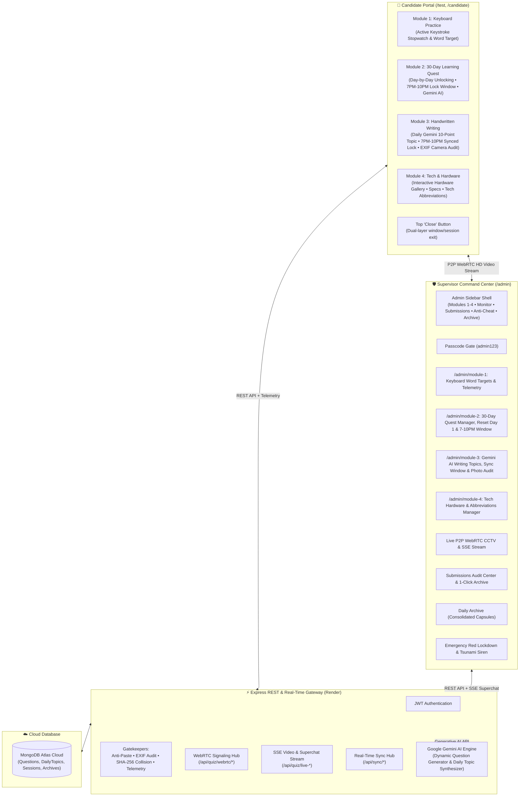

# Sentinel Proctor • Brother Compliance SaaS & Forensic Intelligence Portal 🛡️👁️

<p align="center">
  
  
  
  
  
  
  
  
  
</p>

An enterprise-grade, anti-cheat compliance and continuous surveillance system engineered with the **MERN Stack** (MongoDB Atlas + Express + React 18 + Node.js) paired with **WebRTC P2P Video Streaming** and **Google Gemini AI**.

Engineered for strict remote candidate oversight, authentic skill attestation, and anti-bypass proctoring across 4 core daily disciplines.

---

## 🌐 Live Production Deployment

| Service | Direct URL | Description |
| :--- | :--- | :--- |
| **🛡️ Admin Surveillance Gate** | [brother-compliance-saas.onrender.com](https://brother-compliance-saas.onrender.com/) | Master control room, live CCTV, archives & forensics *(Passcode: `admin123`)* |
| **🎯 Candidate Workstation** | [brother-compliance-saas.onrender.com/test](https://brother-compliance-saas.onrender.com/test) | Dedicated, distraction-free candidate portal for daily tasks |
| **📡 Health Check API** | [brother-compliance-saas.onrender.com/api/health](https://brother-compliance-saas.onrender.com/api/health) | Live backend and gatekeeper operational status |

---

## 🌟 Architecture & Dual-Enclave Partitioning


```mermaid
flowchart TB
    subgraph CandidateEnclave["🎯 Candidate Portal (/test, /candidate)"]
        M1["Module 1: Keyboard Practice\n(Active Keystroke Stopwatch & Word Target)"]
        M2["Module 2: 30-Day Learning Quest\n(Day-by-Day Unlocking • 7PM-10PM Lock Window • Gemini AI)"]
        M3["Module 3: Handwritten Writing\n(Daily Gemini 10-Point Topic • 7PM-10PM Synced Lock • EXIF Camera Audit)"]
        M4["Module 4: Tech & Hardware\n(Interactive Hardware Gallery • Specs • Tech Abbreviations)"]
        CloseBtn["Top 'Close' Button\n(Dual-layer window/session exit)"]
    end

    subgraph BackendGateway["⚡ Express REST & Real-Time Gateway (Render)"]
        Auth["JWT Authentication"]
        Gatekeepers["Gatekeepers:\nAnti-Paste • EXIF Audit • SHA-256 Collision • Telemetry"]
        WebRTC["WebRTC Signaling Hub\n(/api/quiz/webrtc/*)"]
        SSE["SSE Video & Superchat Stream\n(/api/quiz/live-*)"]
        SyncHub["Real-Time Sync Hub\n(/api/sync/*)"]
        GeminiService["Google Gemini AI Engine\n(Dynamic Question Generator & Daily Topic Synthesizer)"]
    end

    subgraph SupervisorEnclave["🛡️ Supervisor Command Center (/admin)"]
        Sidebar["Admin Sidebar Shell\n(Modules 1-4 • Monitor • Submissions • Anti-Cheat • Archive)"]
        AdminAuth["Passcode Gate (admin123)"]
        AdminMod1["/admin/module-1: Keyboard Word Targets & Telemetry"]
        AdminMod2["/admin/module-2: 30-Day Quest Manager, Reset Day 1 & 7-10PM Window"]
        AdminMod3["/admin/module-3: Gemini AI Writing Topics, Sync Window & Photo Audit"]
        AdminMod4["/admin/module-4: Tech Hardware & Abbreviations Manager"]
        CCTV["Live P2P WebRTC CCTV & SSE Stream"]
        Submissions["Submissions Audit Center & 1-Click Archive"]
        Archive["Daily Archive (Consolidated Capsules)"]
        Alarm["Emergency Red Lockdown & Tsunami Siren"]
    end

    subgraph CloudStorage["☁️ Cloud Database"]
        Atlas[("MongoDB Atlas Cloud\n(Questions, DailyTopics, Sessions, Archives)")]
    end

    CandidateEnclave <-->|REST API + Telemetry| BackendGateway
    CandidateEnclave <-->|P2P WebRTC HD Video Stream| SupervisorEnclave
    SupervisorEnclave <-->|REST API + SSE Superchat| BackendGateway
    BackendGateway <--> CloudStorage
    BackendGateway <-->|Generative AI API| GeminiService
```

---

## 🎯 The Candidate Enclave (`/test`, `/candidate`, `/brother`)

* **Zero Distraction Isolation**: All supervisor headers, sidebar navigation, dispatch controls, and administrative actions are **100% removed** for the candidate.
* **Top "Close" Command Bar**: A prominent, rose-tinted `[ ✕ Close ]` button is pinned to the header command bar.
  * **Dual-Layer Close Mechanism**: Executes programmatic script closure (`window.close()`). If the browser security model blocks direct window closure (e.g. tab was opened manually), it immediately unmounts the workspace and presents a clean **Workstation Session Closed** screen with one-click fallback exit (`about:blank`).
* **Permanent Cyber Dark Aesthetics**: Military-grade obsidian backdrop (`#080c14`) with glassmorphic cards, luminous cyan accents, sequence numbering (`01`, `02`, `03`, `04`), and high-contrast typography.
* **Unified Status System**: Clean, readable indicators (`Not Started`, `Under Review`, `✓ Verified`, `⚠ Strike Issued`).

---

## 📋 The 4 Upgraded Daily Disciplines

### ⌨️ Module 1: Keyboard Practice & Live Word Target Tracking
* **Zero Arbitrary Time Limits**: No countdown timers or sudden cut-offs. The candidate has the freedom to type as much or as long as necessary.
* **Starts at `00:00`**: The stopwatch begins counting up only on the first physical keystroke (`● RECORDING ACTIVE WRITING TIME`).
* **Strict Anti-Idling Grace Detector**: If the candidate stops typing for more than **3.5 seconds**, the stopwatch instantly pauses (`❚❚ PAUSED`). Idle minutes cannot be accumulated.
* **Supervisor Word Target Sync**: Live progress counter tracks typed words directly against the supervisor's active requirement (e.g., `150 / 300 words`), glowing **emerald green** upon reaching the goal.
* **Anti-Paste & Injection Shield**:
  * 🚫 `Ctrl+V` and right-click paste events are intercepted and rejected.
  * 🚫 Drag-and-drop text/file insertion is prohibited.
  * 🚫 Tab switches and window blur trigger an immediate security strike and sound the Red Lockdown Alarm on the supervisor's console.
* **Dynamic Telemetry HUD**: Displays real-time words typed, active duration, and live calculated Words Per Minute (WPM).
* **Reset & Clear**: Includes a `[ ↺ CLEAR ]` button to wipe the buffer and restart cleanly.

---

### 🦉 Module 2: Windows 11 Fluent x Duolingo English & Coding Engine
Upgraded with a **30-Day Sequential Quest Roadmap** and **Strict Daily Access Scheduling**:

1. **30-Day Sequential Learning Quest (`Module2RoadmapLanding.jsx`)**:
   * Features a clean, Duolingo-style visual progression map connecting 30 sequential daily milestones.
   * **Day-by-Day Unlocking**: Candidates progress naturally from Day 1 to Day 30. Future days remain locked until preceding days are completed or unlocked by the supervisor.
   * **Targeted Curriculum**:
     * **Basic Coding**: JavaScript fundamentals, variables, loops, conditionals, functions, arrays, and debugging.
     * **English Grammar**: Sentence construction, verb tenses, punctuation, prepositions, and workplace English.
     * **English Fluency**: Reading comprehension, active listening prompts, and conversational vocabulary.
     * *(Note: Computer hardware questions have been transitioned into dedicated Module 4).*

2. **Strict Daily Time Window Lock (7:00 PM – 10:00 PM / 19:00 – 22:00)**:
   * **Enforced Study Hours**: The assessment engine is accessible exclusively between **7:00 PM and 10:00 PM** local time.
   * **Countdown Lock HUD**: Outside this window, a locked state banner displays a live real-time countdown clock (`Opens in: HH:MM:SS`).
   * **Testing Bypass Mode**: Supervisors can enable an instant bypass toggle from `/admin/module-2` for audit and preview testing anytime.

3. **100% Dynamic Gemini AI Question Engine**:
   * Questions are synthesized in real-time via the Google Gemini API (`gemini-flash-lite-latest` / `gemini-3.5-flash-lite` / `gemini-3.6-flash`).
   * **Zero Duplicates Guarantee**: A FIFO sliding-window cache prevents repeating questions across consecutive sessions.
   * **Zero-Knowledge Dealer (`GET /api/quiz/session`)**: Correct answer indexes and explanations are completely scrubbed server-side before delivering payloads to the candidate's browser.
   * **Speed Telemetry Grader (`POST /api/quiz/grade`)**: Flags answers answered in `< 0.8 seconds` as rapid guesswork or bot script anomalies.

4. **WebRTC Video CCTV Surveillance & Superchat**:
   * Candidate picture-in-picture webcam HUD with cybernetic scanlines.
   * Direct P2P WebRTC video stream to supervisor console with SSE stream fallback.
   * Live supervisor Superchat broadcast deck with Web Audio fanfare chimes.

---

### ✍️ Module 3: Handwritten Writing Practice & Hardware EXIF Provenance
Upgraded with **Automated Daily Gemini AI Topic Synthesis** and **Synchronized Time Locking**:

1. **Fully Automated Daily Gemini AI Topic (Zero Manual Clicks Required)**:
   * **1 Unique Topic Per Calendar Day (`YYYY-MM-DD`)**: Automatically synthesized every morning by Google Gemini AI without requiring candidate or supervisor intervention.
   * **Guaranteed Non-Repeating Anti-Repetition Memory**:
     * The backend tracks generated topic history in MongoDB and memory.
     * Prompt explicitly instructs Gemini to exclude all previously used topics across 22+ technology domains (Operating Systems, Cloud & Serverless, Cybersecurity, Computer Networks, Data Structures, Git, Clean Code, Touch Typing, etc.).
     * High-temperature generation (`0.95`) guarantees distinct titles and fresh learning content every single day.
   * **Physical Notebook Format**: Exactly 10 numbered bullet points formatted in simple, accessible English designed for copying by hand onto a physical paper notebook sheet.
   * **Procedural Fail-Safe Bank**: A built-in bank of 20+ comprehensive pre-authored topics ensures zero disruption even during internet outages.

2. **Synchronized 7:00 PM – 10:00 PM Access Window**:
   * Module 3 is synchronized with Module 2's schedule, unlocking strictly during the **7:00 PM – 10:00 PM** evening window.
   * Outside this window, candidate actions and photo uploads are locked with a synchronized countdown HUD (`Opens in: HH:MM:SS`).

3. **Physical Camera EXIF Audit & Duplicate Rejection**:
   * Supports up to 5 multi-page notebook photo slots.
   * Extracts device sensor tags (iPhone, Samsung Galaxy, etc.) and `DateTimeOriginal` to guarantee photos were taken **today during the active session**.
   * Evaluates SHA-256 and MD5 cryptographic hashes against past archives to reject duplicate photo submissions.

---

### 🍳 Module 4: Hardware & Tech Foundations (The "Restaurant Kitchen" Model)
Spec sheets and engineering jargon (GHz, DDR5 timings, pin counts, IOPS) can overwhelm college freshmen with no prior tech background. Module 4 completely abandons spec sheets and translates computer architecture into relatable real-world concepts across 3 progressive stages:

1. **The "Restaurant Kitchen" Mental Model (`Module4TechHardwareModal.jsx`)**:
   * **The Chef (CPU)**: The central processing unit that executes orders and cooks meals. A faster chef prepares meals (processes digital instructions) quicker.
   * **The Countertop (RAM)**: The active workspace holding apps currently open on screen (Spotify, 20 Chrome tabs, Word paper). *Critical Rule*: The countertop is **volatile memory**—turning off the kitchen lights (power failure or dead battery) wipes the countertop completely clean!
   * **The Pantry (SSD / HDD)**: Permanent storage where raw ingredients, files, and recipes stay safe even when the kitchen is closed. An SSD is a modern walk-in pantry right next to the chef; an old mechanical HDD is like a cold basement with a spiral staircase (slow spinning magnetic disks).
   * **The Waiter & Floor (Motherboard)**: The nervous system and highway connecting all stations, routing ingredients between the pantry, countertop, and chef.
   * **The Specialist Sous-Chef (GPU)**: A specialized helper cook engineered to perform thousands of parallel tasks simultaneously (e.g. chopping 10,000 carrots at once or rendering 3D graphics).
   * **The Power Mains (PSU & Battery)**: Clean regulated power supplying all appliances.

2. **College-Life Troubleshooting Dilemmas & AI Generation**:
   * Interactive scenario-based diagnosis of real-world dorm and campus dilemmas:
     * 😱 **The 2:00 AM "Essay Panic"**: Typing an essay for two hours when battery dies. Word document is blank on reboot → *RAM countertop was wiped; essay wasn't saved into the permanent SSD pantry.*
     * 🐌 **The "Lagging Zoom Lecture"**: Zoom + 40 browser tabs open; video stutters while CPU is only at 20% → *RAM countertop is 100% full, forcing slow paging/swapping to disk.*
     * 🎮 **The "Slow Game Map Load"**: Roommate loads game in 8 seconds while candidate takes 4 minutes with internal clicking sounds → *Mechanical HDD platter bottleneck vs modern NAND flash SSD.*
     * 🔥 **The "Blazing Hot Lap Burner"**: Laptop on soft bed comforter slows down → *Blocked cooling vents causing thermal throttling.*
     * 💾 **The "Corrupted Group Presentation"**: Flash drive pulled without clicking "Eject" → *Abrupt disconnect interrupted write caching from RAM.*
   * **Dynamic Google Gemini Scenario Synthesis**: Candidate can click `✨ Ask Gemini for Fresh Case` (`POST /api/tasks/module4/generate-case`) to generate novel campus troubleshooting dilemmas on the fly.

3. **"Know Your Own Rig" (Hands-On Machine Audit)**:
   * Direct practical audit of the candidate's actual computer, with cross-platform GUI guides (Windows Task Manager / macOS Activity Monitor) and harmless terminal commands:
     * **Step 1: Check CPU Chef & Load**: Inspect processor model and live % utilization.
     * **Step 2: Measure RAM Countertop**: Determine total installed capacity (8GB vs 16GB) and current usage.
     * **Step 3: Identify Waiter's Route**: Verify whether connection is wireless Wi-Fi radio waves or wired Ethernet.
   * Telemetry is stamped and submitted directly to the supervisor's compliance desk (`/admin/module-4`).

---

## 🛡️ Modular Supervisor Command Center (`/admin`)

The admin interface has been restructured from a single overloaded view into **dedicated, specialized module control centers**:

```
/admin
├── /admin             -> Executive Intelligence Board & Master Telemetry
├── /admin/module-1    -> Module 1 Keyboard Practice (Word Targets, WPM Cadence)
├── /admin/module-2    -> Module 2 Daily Quest (Roadmap Days, Reset Day 1, 7-10PM Lock)
├── /admin/module-3    -> Module 3 Writing Practice (Gemini AI Topics, Sync Window, EXIF)
├── /admin/module-4    -> Module 4 Tech & Hardware (Hardware Catalog & Abbreviations)
├── /admin/submissions -> Dedicated Submissions Audit Center & Approvals
├── /admin/anti-cheat  -> Live WebRTC CCTV, Strike Counter & Incident Dossier
└── /admin/archive     -> Consolidated Daily Submission Capsules (JSON Export)
```

### Module Control Features:
* **`/admin/module-1`**: Configure typing target presets (`100`, `200`, `300 [Default]`, `500 words`), view live keystroke cadence, and inspect candidate typing duration.
* **`/admin/module-2`**: Set the active unlocked roadmap day (Day 1 to 30), click **"Reset to Day 1"** to restart curriculum progress, adjust question limit presets (`10`, `25`, `50`, `100`), toggle the **7 PM – 10 PM Testing Bypass**, or customize access hours.
* **`/admin/module-3`**: Inspect today's Gemini-generated topic and 10 points, review the synchronized time window status, audit uploaded notebook photos in a high-resolution lightbox, record approval/rewrite verdicts, and update the **Google Gemini API Key** directly from the browser.
* **`/admin/module-4`**: Browse the hardware catalog, inspect specifications, and verify candidate hardware quiz performance.

---

## 📡 Complete REST API Endpoint Inventory

| # | Method | Endpoint | Pipeline / Access | Description | Status |
|---|---|---|---|---|---|
| **Core & Auth** | | | | | |
| 1 | `GET` | `/api/health` | Public | Operational health check & gatekeeper statuses | ✅ 200 OK |
| 2 | `GET` | `/api/network-info` | Public | LAN IP & cloud discovery URLs for multi-device testing | ✅ 200 OK |
| 3 | `POST` | `/api/auth/login` | Public | Supervisor / Candidate authentication & JWT grant | ✅ 200 OK |
| 4 | `POST` | `/api/auth/register` | Public | Registers user profile, hashes password, returns JWT | ✅ 201 Created |
| 5 | `GET` | `/api/auth/me` | Bearer JWT | Decrypts token claims and returns authenticated profile | ✅ 200 OK |
| **Tasks & Daily Disciplines** | | | | | |
| 6 | `GET` | `/api/tasks` | Public | Retrieves active compliance task definitions | ✅ 200 OK |
| 7 | `GET` | `/api/tasks/:id` | Public | Retrieves single compliance task definition | ✅ 200 OK |
| 8 | `POST` | `/api/tasks` | Public | Creates custom compliance tasks dynamically | ✅ 201 Created |
| 9 | `GET` | `/api/tasks/daily-writing-topic` | Public | Returns today's automated Gemini AI 10-point topic | ✅ 200 OK |
| 10 | `POST` | `/api/tasks/daily-writing-topic/generate` | Supervisor | Synthesizes a fresh non-repeating Gemini topic | ✅ 200 OK |
| 11 | `GET` | `/api/tasks/daily-writing-topic/status` | Public | Gemini engine health, connection & recent topic history | ✅ 200 OK |
| 12 | `POST` | `/api/tasks/gemini-key` | Supervisor | Configures/updates Gemini API key at runtime | ✅ 200 OK |
| 13 | `GET` | `/api/tasks/module4/cases` | Public | Foundational college troubleshooting scenarios | ✅ 200 OK |
| 14 | `POST` | `/api/tasks/module4/generate-case` | Public | Dynamically synthesizes fresh troubleshooting cases with Gemini AI | ✅ 200 OK |
| **Quiz & AI Engine** | | | | | |
| 13 | `GET` | `/api/quiz/settings` | Public | Fetches question count limit (default: 50) | ✅ 200 OK |
| 14 | `POST` | `/api/quiz/settings` | Public | Updates question count limit | ✅ 200 OK |
| 15 | `GET` | `/api/quiz/session` | Zero-Knowledge | Deals dynamic Gemini AI questions with scrubbed answers | ✅ 200 OK |
| 16 | `POST` | `/api/quiz/grade` | Speed Telemetry | Evaluates answers, audits <0.8s bot speeds | ✅ 200 OK |
| 17 | `GET` | `/api/quiz/stats` | Public | Question bank metrics, DB status, and AI engine status | ✅ 200 OK |
| 18 | `POST` | `/api/quiz/generate` | Public | On-demand batch generation of AI questions | ✅ 200 OK |
| **Surveillance & WebRTC** | | | | | |
| 19 | `POST` | `/api/quiz/live-frame` | Public | Candidate broadcasts snapshot frame (1-2 FPS fallback) | ✅ 200 OK |
| 20 | `GET` | `/api/quiz/live-stream` | SSE Stream | Supervisor Server-Sent Events live video feed | ✅ 200 OK |
| 21 | `POST` | `/api/quiz/live-stream-end` | Public | Clean termination of live webcam stream | ✅ 200 OK |
| 22 | `POST` | `/api/quiz/live-message` | Public | Supervisor broadcasts live superchat notice to candidate | ✅ 200 OK |
| 23 | `POST` | `/api/quiz/webrtc/offer` | WebRTC | Candidate posts SDP offer for P2P video call | ✅ 200 OK |
| 24 | `POST` | `/api/quiz/webrtc/answer` | WebRTC | Supervisor posts SDP answer to complete handshake | ✅ 200 OK |
| 25 | `POST` | `/api/quiz/webrtc/ice` | WebRTC | Exchanges ICE candidates for UDP NAT traversal | ✅ 200 OK |
| 26 | `GET` | `/api/quiz/webrtc/status` | WebRTC | Checks WebRTC signaling connection state | ✅ 200 OK |
| 27 | `POST` | `/api/quiz/webrtc/reset` | WebRTC | Resets / disconnects WebRTC session | ✅ 200 OK |
| 28 | `POST` | `/api/quiz/webrtc/request`| WebRTC | Supervisor requests fresh WebRTC call from candidate | ✅ 200 OK |
| **Submissions & Forensics** | | | | | |
| 29 | `POST` | `/api/submissions/submit` | Multer, Hash, EXIF | Submits task payload with cryptographic hash & EXIF checks | ✅ 201 Created |
| 30 | `POST` | `/api/tasks/submit` | Multer, Hash, EXIF | Unified submission route for task pipelines | ✅ 201 Created |
| 31 | `GET` | `/api/submissions` | Public | Retrieves all submission records and audit logs | ✅ 200 OK |
| 32 | `GET` | `/api/submissions/:id` | Public | Retrieves detailed single submission audit log | ✅ 200 OK |
| 33 | `GET` | `/api/reports/:sessionId` | Digital Forensics | Generates structured forensic compliance audit report | ✅ 200 OK |
| **Cross-Device Sync** | | | | | |
| 34 | `GET` | `/api/sync/state` | Public | Full real-time sync state (tasks, strikes, lockdown) | ✅ 200 OK |
| 35 | `GET` | `/api/sync/version` | Public | Fast-polling version number for change detection | ✅ 200 OK |
| 36 | `POST` | `/api/sync/task-submit` | Public | Marks a task as submitted across all devices | ✅ 200 OK |
| 37 | `POST` | `/api/sync/task-verdict` | Public | Sets approval/rejection verdict for a task | ✅ 200 OK |
| 38 | `POST` | `/api/sync/breach` | Public | Registers a security breach & engages red lockdown | ✅ 200 OK |
| 39 | `POST` | `/api/sync/disarm` | Public | Physically disarms the red lockdown alarm | ✅ 200 OK |
| 40 | `POST` | `/api/sync/reset-task` | Public | Resets a single task for the next day | ✅ 200 OK |
| 41 | `POST` | `/api/sync/reset-all` | Public | Resets all tasks and sync state | ✅ 200 OK |
| 42 | `POST` | `/api/sync/settings` | Public | Updates sync settings (question limits, time windows) | ✅ 200 OK |

---

## 🔒 Security & Anti-Cheat Summary

| Protection Layer | Enforcement Mechanism | Action on Violation |
| :--- | :--- | :--- |
| **External Clipboard** | Event interceptor on `paste` and `drop` | Input blocked + Red Lockdown Alarm |
| **Focus Loss & Tab Switching** | `visibilitychange` & `window.onblur` surveillance | Strike logged + snapshot taken + Red Lockdown Alarm |
| **Idle Time Exploitation** | 3.5s keystroke grace cadence detector | Stopwatch automatically pauses |
| **Recycled Photo Submissions** | SHA-256 / MD5 cryptographic collision checks | Blocked upon submission attempt |
| **Fake Handwritten Work** | Hardware EXIF tags & capture timestamp delta | Flagged if edited, non-camera, or not taken today |
| **Bot Speed Exploitation** | Per-question response timing detector (<0.8s) | Flagged as cadence anomaly, integrity score drops |
| **Inspect Element Cheat** | Zero-knowledge question dealer scrubbing | Answers are physically absent from frontend memory |
| **Alarm Dismissal** | Hardened state retention | Requires physical disarm on supervisor dashboard |
| **Off-Hours Assessment Access** | Synchronized 7:00 PM – 10:00 PM window lock | Sessions locked with live countdown timer |

---

## 🚀 Running Locally

### Prerequisites
* **Node.js**: v18.0.0 or higher
* **MongoDB**: MongoDB Atlas connection string or local MongoDB on port 27017 (auto-fallback built in)
* **Google Gemini API Key**: *(Optional but recommended for infinite AI questions and topics)* — get one free at [aistudio.google.com](https://aistudio.google.com/)

### 1. Configure Environment
Create `backend/.env` (copy from `backend/.env.example`):
```env
PORT=5001
NODE_ENV=development
MONGO_URI=mongodb+srv://<username>:<password>@cluster0.t9zyrqz.mongodb.net/brother_compliance?retryWrites=true&w=majority
JWT_SECRET=super_secret_jwt_key_2026
CLIENT_URL=http://localhost:5173
GEMINI_API_KEY=your_gemini_api_key_here
```

### 2. Install & Start Development Servers
```bash
# Terminal 1 - Backend (port 5001):
cd backend
npm install
npm run dev

# Terminal 2 - Frontend (port 5173):
cd frontend
npm install
npm run dev
```

### 3. Access Portals
| Portal | URL | Credentials |
| :--- | :--- | :--- |
| **🎯 Candidate Workstation** | `http://localhost:5173/test` | — |
| **🛡️ Supervisor Command Center** | `http://localhost:5173/admin` | Passcode: `admin123` |
| **📊 Module 1 Control** | `http://localhost:5173/admin/module-1` | Passcode: `admin123` |
| **🦉 Module 2 Control** | `http://localhost:5173/admin/module-2` | Passcode: `admin123` |
| **✍️ Module 3 Control** | `http://localhost:5173/admin/module-3` | Passcode: `admin123` |
| **💻 Module 4 Control** | `http://localhost:5173/admin/module-4` | Passcode: `admin123` |
| **📡 Health Check API** | `http://localhost:5001/api/health` | — |

---

## 📁 Repository Structure

```
sentinel-proctor/
├── frontend/                          # Vite + React 18 Single Page Application
│   ├── src/
│   │   ├── components/
│   │   │   ├── ui/                    # Shared design system primitives
│   │   │   │   ├── Badge.jsx          # Unified StatusBadge and Badge tags
│   │   │   │   ├── Button.jsx         # Primary, secondary, danger, ghost variants
│   │   │   │   ├── Card.jsx           # Card, CardHeader, CardBody, CardFooter
│   │   │   │   ├── EmptyState.jsx     # Consistent empty data states
│   │   │   │   ├── SectionHeader.jsx  # PageHeader & SectionHeader components
│   │   │   │   ├── StatCard.jsx       # KPI card with progress bars & status colors
│   │   │   │   └── index.js           # Barrel export
│   │   │   ├── AdminLayout.jsx        # Supervisor application shell wrapper
│   │   │   ├── AdminSidebar.jsx       # Persistent navigation sidebar with module links
│   │   │   ├── AdminGate.jsx          # Passcode protection gate for supervisor enclave
│   │   │   ├── AdminIntelligenceBoard.jsx # Executive surveillance board & KPI telemetry
│   │   │   ├── AdminModule1Page.jsx   # Dedicated Module 1 Control (Word Target & WPM)
│   │   │   ├── AdminModule2Page.jsx   # Dedicated Module 2 Control (Quest Days, Reset Day 1, 7-10PM Lock)
│   │   │   ├── AdminModule3Page.jsx   # Dedicated Module 3 Control (Gemini Topics, Time Sync & EXIF)
│   │   │   ├── AdminModule4Page.jsx   # Dedicated Module 4 Control (Tech Hardware & Acronyms)
│   │   │   ├── Module2RoadmapLanding.jsx # Duolingo-style 30-Day Sequential Quest Landing
│   │   │   ├── Module4TechHardwareModal.jsx # Tech, Hardware & Abbreviations Workstation
│   │   │   ├── SubjectHub.jsx         # Candidate portal (Disciplines 1, 2, 3, 4 + Close button)
│   │   │   ├── EnglishQuizModal.jsx   # Win11 x Duolingo engine + webcam HUD + superchat
│   │   │   ├── LiveProctorCCTV.jsx    # Supervisor WebRTC P2P CCTV deck & superchat broadcast
│   │   │   ├── DailyArchivePage.jsx   # Consolidated daily submission archive
│   │   │   ├── AntiCheatPage.jsx      # Live CCTV surveillance & forensic incident dossier
│   │   │   ├── SubmissionsBoxPage.jsx # Dedicated submissions audit center
│   │   │   └── RedLockdownBanner.jsx  # Emergency red alarm banner & physical disarm switch
│   │   ├── context/
│   │   │   └── ForensicContext.jsx    # Central state, audio synth, WebRTC & tab sync
│   │   ├── data/
│   │   │   ├── techHardwareData.js    # Hardware components, AI images, specs & glossary
│   │   │   ├── writingTopics.js       # Curated 10-point daily writing topics
│   │   │   └── questionSeed.js        # Deprecated stub (AI-generated questions replaced static bank)
│   │   ├── assets/
│   │   │   └── index.css              # Cyber Dark Tailwind styles & animations
│   │   ├── App.jsx                    # Route isolation (/test vs /admin enclaves)
│   │   └── main.jsx                   # React DOM entry point
│   ├── vite.config.js                 # Vite build, dev proxy (/api → :5001) & LAN host
│   ├── tailwind.config.js             # Tailwind CSS configuration
│   └── package.json
│
├── backend/                           # Node.js + Express REST API & WebRTC Signaling
│   ├── src/
│   │   ├── config/
│   │   │   ├── db.js                  # MongoDB connection + SRV DNS fix + graceful fallback
│   │   │   └── env.js                 # Environment variable schema with sensible defaults
│   │   ├── controllers/
│   │   │   ├── authController.js      # Supervisor & candidate authentication
│   │   │   ├── quizController.js      # Quiz dealer, grader, CCTV streaming & WebRTC signaling
│   │   │   ├── taskController.js      # Task bank management & daily Gemini writing topics
│   │   │   ├── submissionController.js# Ingestion, EXIF audit & duplicate hash check
│   │   │   ├── syncController.js      # Cross-device real-time state synchronization hub
│   │   │   └── reportController.js    # Forensic compliance audit report generator
│   │   ├── models/
│   │   │   ├── Question.js            # MongoDB schema for AI-generated assessment questions
│   │   │   ├── SessionLog.js          # MongoDB schema for session records, submissions & telemetry
│   │   │   ├── Task.js                # MongoDB schema for compliance disciplines
│   │   │   └── User.js                # MongoDB schema for users & credentials
│   │   ├── routes/
│   │   │   ├── authRoutes.js          # /api/auth endpoints
│   │   │   ├── quizRoutes.js          # /api/quiz endpoints (AI, CCTV, WebRTC)
│   │   │   ├── taskRoutes.js          # /api/tasks discipline & Gemini topic endpoints
│   │   │   ├── submissionRoutes.js    # /api/submissions ingestion endpoints
│   │   │   ├── syncRoutes.js          # /api/sync cross-device synchronization endpoints
│   │   │   └── reportRoutes.js        # /api/reports forensic audit endpoints
│   │   ├── services/
│   │   │   ├── aiQuestionService.js   # 100% Google Gemini AI dynamic question engine
│   │   │   ├── dailyWritingTopicService.js # Dynamic Gemini topic synthesis with anti-repetition
│   │   │   ├── complianceScorer.js    # Speed cadence & integrity scoring engine
│   │   │   ├── hashService.js         # File fingerprinting & collision verification
│   │   │   └── ocrService.js          # Optical character recognition verification
│   │   └── server.js                  # Express bootstrap, WebRTC signaling & static SPA server
│   ├── .env.example                   # Environment variable template
│   └── package.json
│
├── Dockerfile                         # Multi-stage Docker build
├── docker-compose.yml                 # Full-stack Docker Compose (app + MongoDB 7.0)
├── render.yaml                        # Render deployment blueprint
├── package.json                       # Unified root scripts for build & start
└── README.md
```

---

## 📜 License & Acknowledgments

* Built with [React](https://react.dev/), [Vite](https://vitejs.dev/), [Tailwind CSS](https://tailwindcss.com/), [Express](https://expressjs.com/), [MongoDB](https://www.mongodb.com/), and [Google Gemini AI](https://aistudio.google.com/).
* Engineered for high-integrity academic discipline, authentic skill verification, and remote proctoring.
