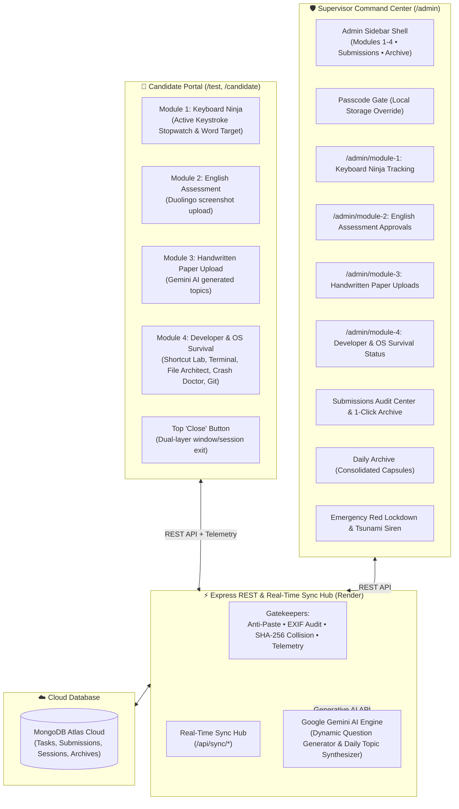

# Sentinel Proctor • Brother Compliance SaaS & Forensic Intelligence Portal 🛡️👁️

<p align="center">
  
  
  
  
  
  
  
  
</p>

An enterprise-grade, anti-cheat compliance and task tracking system engineered with the **MERN Stack** (MongoDB Atlas + Express + React 18 + Node.js) paired with **Google Gemini AI**.

Engineered for strict remote candidate oversight, authentic skill attestation, and anti-bypass proctoring across 4 core daily disciplines.

---

## 🌐 Live Production Deployment

| Service | Direct URL | Description |
| :--- | :--- | :--- |
| **🛡️ Admin Surveillance Gate** | [brother-compliance-saas.onrender.com](https://brother-compliance-saas.onrender.com/) | Master control room, archives & forensics *(Passcode: Set via `$ADMIN_PASSCODE`)* |
| **🎯 Candidate Workstation** | [brother-compliance-saas.onrender.com/test](https://brother-compliance-saas.onrender.com/test) | Dedicated, distraction-free candidate portal for daily tasks |
| **📡 Health Check API** | [brother-compliance-saas.onrender.com/api/health](https://brother-compliance-saas.onrender.com/api/health) | Live backend and gatekeeper operational status |

---

## 🌟 Architecture & Dual-Enclave Partitioning


```mermaid
flowchart TB
    subgraph CandidateEnclave["🎯 Candidate Portal (/test, /candidate)"]
        M1["Module 1: Keyboard Ninja\n(Active Keystroke Stopwatch & Word Target)"]
        M2["Module 2: English Assessment\n(Duolingo screenshot upload)"]
        M3["Module 3: Handwritten Paper Upload\n(Gemini AI generated topics)"]
        M4["Module 4: Developer & OS Survival\n(Shortcut Lab, Terminal, File Architect, Crash Doctor, Git)"]
        CloseBtn["Top 'Close' Button\n(Dual-layer window/session exit)"]
    end

    subgraph BackendGateway["⚡ Express REST & Real-Time Sync Hub (Render)"]
        Gatekeepers["Gatekeepers:\nAnti-Paste • EXIF Audit • SHA-256 Collision • Telemetry"]
        SyncHub["Real-Time Sync Hub\n(/api/sync/*)"]
        GeminiService["Google Gemini AI Engine\n(Dynamic Question Generator & Daily Topic Synthesizer)"]
    end

    subgraph SupervisorEnclave["🛡️ Supervisor Command Center (/admin)"]
        Sidebar["Admin Sidebar Shell\n(Modules 1-4 • Submissions • Archive)"]
        AdminAuth["Passcode Gate (Local Storage Override)"]
        AdminMod1["/admin/module-1: Keyboard Ninja Tracking"]
        AdminMod2["/admin/module-2: English Assessment Approvals"]
        AdminMod3["/admin/module-3: Handwritten Paper Uploads"]
        AdminMod4["/admin/module-4: Developer & OS Survival Status"]
        Submissions["Submissions Audit Center & 1-Click Archive"]
        Archive["Daily Archive (Consolidated Capsules)"]
        Alarm["Emergency Red Lockdown & Tsunami Siren"]
    end

    subgraph CloudStorage["☁️ Cloud Database"]
        Atlas[("MongoDB Atlas Cloud\n(Tasks, Submissions, Sessions, Archives)")]
    end

    CandidateEnclave <-->|REST API + Telemetry| BackendGateway
    SupervisorEnclave <-->|REST API| BackendGateway
    BackendGateway <--> CloudStorage
    BackendGateway <-->|Generative AI API| GeminiService
```

---

## 🎯 The Candidate Enclave (`/test`, `/candidate`, `/brother`)

* **Zero Distraction Isolation**: All supervisor headers, sidebar navigation, dispatch controls, and administrative actions are **100% removed** for the candidate.
* **Top "Close" Command Bar**: A prominent `[ ✕ Close ]` button is pinned to the header command bar.
* **Permanent Cyber Dark Aesthetics**: Military-grade obsidian backdrop (`#080c14`) with glassmorphic cards, luminous cyan accents, sequence numbering (`01`, `02`, `03`, `04`), and high-contrast typography.
* **Unified Status System**: Clean, readable indicators (`Not Started`, `Under Review`, `✓ Verified`, `⚠ Strike Issued`).

---

## 📋 The 4 Upgraded Daily Disciplines (Expanded Curriculum)

### ⌨️ Module 1: Keyboard Ninja
* **Zero Arbitrary Time Limits**: No countdown timers or sudden cut-offs. The candidate has the freedom to type as much or as long as necessary.
* **Starts at `00:00`**: The stopwatch begins counting up only on the first physical keystroke (`● RECORDING ACTIVE WRITING TIME`).
* **Strict Anti-Idling Grace Detector**: If the candidate stops typing for more than **3.5 seconds**, the stopwatch instantly pauses (`❚❚ PAUSED`). Idle minutes cannot be accumulated.
* **Supervisor Word Target Sync**: Live progress counter tracks typed words directly against the supervisor's active requirement.
* **Anti-Paste & Injection Shield**: `Ctrl+V` and right-click paste events are intercepted and rejected.

### 🦉 Module 2: English Assessment (Duolingo screenshot upload)
* Candidates complete daily language assessment tasks on platforms like Duolingo.
* They capture screenshots of their progress or lesson completion.
* Upload these screenshots directly via the portal for supervisor review.

### ✍️ Module 3: Handwritten Paper Upload (Gemini AI generated topics)
* **Fully Automated Daily Gemini AI Topic**: Synthesized every morning by Google Gemini AI.
* **Guaranteed Non-Repeating Anti-Repetition Memory**: Prevents repeating questions across consecutive sessions.
* **Physical Notebook Format**: Formatted in simple, accessible English designed for copying by hand onto a physical paper notebook sheet.
* **Physical Camera EXIF Audit & Duplicate Rejection**: Extracts device sensor tags and `DateTimeOriginal` to guarantee photos were taken today during the active session. Evaluates cryptographic hashes to reject duplicate photo submissions.

### 💻 Module 4: Developer & OS Survival (30-Day Multi-Track Curriculum)
* Features a massive newly integrated multi-day progressive curriculum across 5 distinct tracks.
* **Track 1 (Keyboard Ninja / Shortcut Lab)**: Browser-safe keyboard shortcut mastery with simulated UI feedback.
* **Track 2 (Terminal Rookie)**: 6 days of progressive terminal challenges, from File System Basics to Advanced grep and pipes.
* **Track 3 (File Architect)**: Forensic file inspection, quarantine protocols, and zip extraction.
* **Track 4 (Crash Doctor)**: Task Manager simulation for identifying and halting rogue, hung, or malicious system processes.
* **Track 5 (Git Factory)**: Progressive conveyor-belt style training for standard git branch/commit/push workflows.
* **Progression System**: Each track features 6 days of content gated by real-world calendar days and strict session locks.

---

## 🛡️ Admin Console (Approval workflow, Dashboards)

The admin interface provides dedicated module control centers and dashboards:

* **Executive Intelligence Board**: High-level overview of daily compliance.
* **Submissions Audit Center & Approvals**: Review submissions for Module 2 and Module 3, with 1-click approvals or rejections.
* **`/admin/module-1`**: Inspect live keystroke cadence and view candidate typing duration.
* **`/admin/module-2`**: Review English assessment screenshot uploads.
* **`/admin/module-3`**: Review handwritten paper uploads and update the Gemini API Key.
* **`/admin/module-4`**: Verify candidate Developer & OS Survival progress.

---

## 🚀 Running Locally

### Prerequisites
* **Node.js**: v18.0.0 or higher
* **MongoDB**: MongoDB Atlas connection string or local MongoDB on port 27017
* **Google Gemini API Key**: *(Optional but recommended for AI topics)*

### 1. Configure Environment
Create `backend/.env` (copy from `backend/.env.example`):
```env
PORT=5001
NODE_ENV=development
MONGO_URI=mongodb+srv://<username>:<password>@cluster0.t9zyrqz.mongodb.net/brother_compliance?retryWrites=true&w=majority
JWT_SECRET=<your_secure_random_jwt_secret>
CLIENT_URL=http://localhost:5173
GEMINI_API_KEY=your_gemini_api_key_here
```

### 2. Install & Start Development Servers
```bash
# Terminal 1 - Backend (port 5001):
cd backend
npm install
npm run dev

# Terminal 2 - Frontend (port 5173):
cd frontend
npm install
npm run dev
```

---

## 📜 License & Acknowledgments

* Built with [React](https://react.dev/), [Vite](https://vitejs.dev/), [Tailwind CSS](https://tailwindcss.com/), [Express](https://expressjs.com/), [MongoDB](https://www.mongodb.com/), and [Google Gemini AI](https://aistudio.google.com/).
* Engineered for high-integrity academic discipline, authentic skill verification, and remote proctoring.
